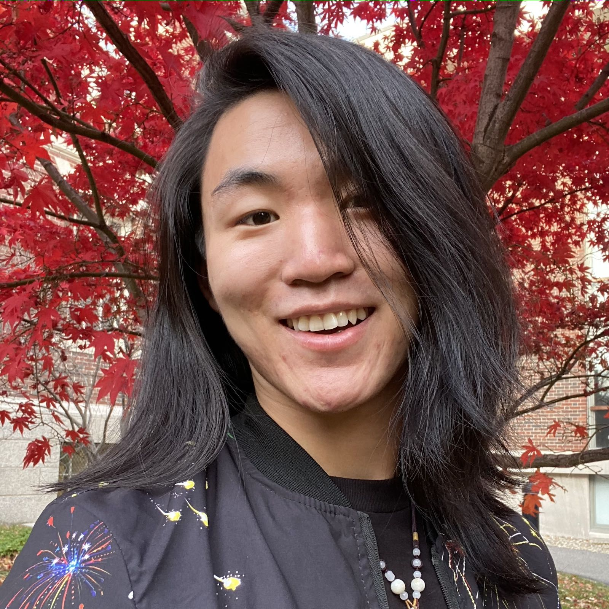

# Bobby Chen

Hello! 你好！

I blog about software development. I like compilers, networking, and databases. I dislike pasta and cilantro.

__[Take a look at my blog](/blog)__.

 

|              |                                                                  |
|--------------|------------------------------------------------------------------|
| __GitHub__   | __[@chenbobby](https://github.com/chenbobby)__                   |
| __Twitter__  | __[@chenbobby168](https://twitter.com/chenbobby168)__            |
| __LinkedIn__ | __[/in/chenbobby168](https://www.linkedin.com/in/chenbobby168)__ |

 

---

# Resumé

## Education

    

        

            
            
                <a href="https://www.harvard.edu">
                    Harvard University
                </a>
            
        

        
            August 2017 - May 2022
        
    

    

        <b>B.A. in Applied Mathematics and Computer Science</b>
    

    

        <b>Language Citation in Chinese (Mandarin)</b>
    

## Work Experience

    

        

            
            
                <a href="https://careers.airbnb.com">
                    Airbnb
                </a>
            
        

        
            May 2021 - August 2021
        
    

    

        <b><em>Software Engineering Intern</em></b>, Compliance and Financial Crimes
    

* __Designed and built a React app__ for Compliance and Financial Crimes auditors.
* __Migrated a deprecated Ruby service__ to a new Kotin job runner.
* Used [Ruby](https://www.ruby-lang.org), [Kotlin](https://kotlinlang.org/), [TypeScript](https://www.typescriptlang.org/), and [ReactJS](https://reactjs.org/).

 
 

    

        

            
            
                <a href="https://elementl.com/">
                    Elementl
                </a>
            
        

        
            September 2020 - March 2021
        
    

    

        <b><em>Software Engineering Fellow</em></b>, Dagster
    

* Supported corporate partners with __Apache Spark integrations with Dagster__.
* Researched user needs by conducting __user interviews with 15+ companies__, including Apple, Carvana, and Thinking Machines.
* Extended the __dagster-dbt integration library__ and co-authored a [marketing blog post](https://dagster.io/blog/dagster-dbt).
* Maintained development and production __deployments on Google Cloud Platform__ for internal use by the company.
* Used SQL, [Python](https://www.python.org/), [dbt](https://www.getdbt.com/), [Docker](https://www.docker.com/), [Kubernetes](https://kubernetes.io/), [Helm](https://helm.sh/), [Amazon Web Services](https://aws.amazon.com/), and [Google Cloud Platform](https://cloud.google.com/).

 
 

    

        

            
            
                <a href="https://www.intel.com/content/www/us/en/jobs/jobs-at-intel.html">
                    Intel
                </a>
            
        

        
            June 2020 - August 2020
        
    

    

        <b><em>Technical Marketing Intern</em></b>, Hardware Plugins for Kubernetes
    

* Designed a marketing demo to __showcase 5x Redis performance improvement__ (operations per second) when using [Intel Optane Persistent Memory](https://www.intel.com/content/www/us/en/architecture-and-technology/optane-dc-persistent-memory.html) with Kubernetes.
* __Wrote documentation and technical copy__ for Intel hardware plugins for Kubernetes.
* __Hosted Intel's conference booth__ at [KubeCon Europe 2020](https://events.linuxfoundation.org/archive/2020/kubecon-cloudnativecon-europe/).
* Used [Redis](https://redis.io/), [Kubernetes](https://kubernetes.io/), HTML, CSS, and JavaScript.

 
 

    

        

            
            
                <a href="https://www.datacamp.com/jobs">
                    DataCamp
                </a>
            
        

        
            May 2018 - July 2018
        
    

    

        <b><em>Software Engineering Intern</em></b>, Full-Stack Web Development
    

* __Decreased query time for course search from 6 seconds to 1 second__, by migrating a naive SQL query to use Algolia's Indexing and Search API.
* __Reduced JavaScript bundle size by 15%__, increasing the web app's rendering speed.
* __Added privacy controls for GDPR compliance__ on user data.
* Used [Ruby on Rails](https://rubyonrails.org/), [Algolia API](https://www.algolia.com/doc/), HTML, CSS, and JavaScript.

 
 

    

        

            
            
                <a href="https://hpair.org/">
                    HPAIR
                </a>
            
        

        
            September 2017 - August 2020
        
    

    

        <b><em>Director of Technology</em></b>
    

* Implemented Django REST API endpoints for the conference mobile app, used by __500+ delegates__ during the 5 days of conference events.
* Developed a custom application portal, used by __1000+ monthly applicants from 70+ countries__.
* __Built an analytics dashboard__ for applicant demographics and attendee engagement.
* Designed admin views for non-technical colleagues to independently control website content, allowing the Technology Team to focus on new projects and technical features.
* Used [Python](https://www.python.org/), [Django](https://www.djangoproject.com/), [PostgreSQL](https://www.postgresql.org/), [Docker](https://www.docker.com/), [Kubernetes](https://kubernetes.io/), and [Google Cloud Platform](https://cloud.google.com/).
